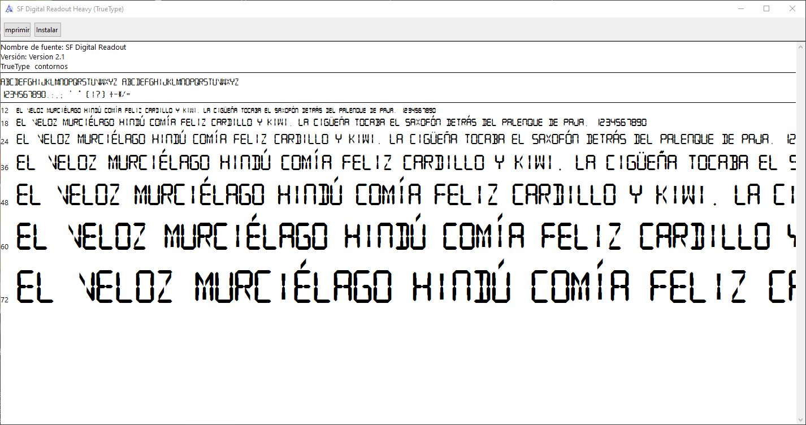
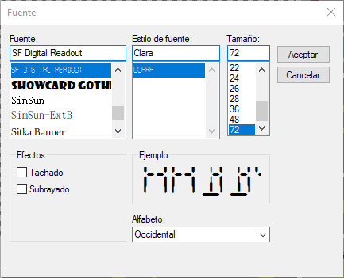

Proyecto de Sistemas programables

PROYECTO HECHO POR <3 :

┏━━━━━━━━━━━━━━━❖(^･ｪ･^)❖━━━━━━━━━━━━━━━━┓

✧ Myriam Yazmin Patiño Segura     #19100231

✧ Aldo Ezequiel Rodriguez Mendez  #19100243

✧ AlMy✧❤️✧

┗━━━━━━━━━━━━━━━━❖(^･ｪ･^)❖━━━━━━━━━━━━━━━┛

Para poder utilizar el tipo de letra Digital Font en el proyecto se

debe instalar el archivo ** SF Digital Redount.tttf ** 

Dentro del proyecto de visual studio se seleccionan los displays y se cambia

el tipo de letra a SF Digital Redount 

